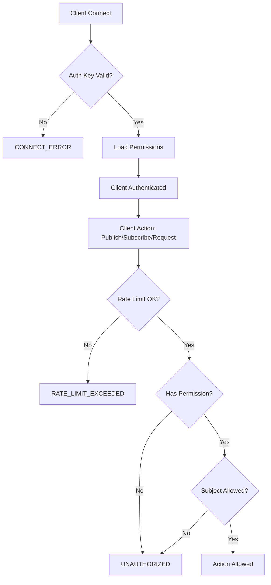

# Engine5Go Güvenlik Rehberi
> Dikkat - Bu belge LLM ile hazırlanmıştır. Gördüğünüz hataları issue olarak açabilirsiniz

Bu dokümanda Engine5Go TCP server'ınızı güvenli bir şekilde production ortamında çalıştırmak için gerekli adımları bulacaksınız.

## 🔒 Güvenlik Özellikleri

### 1. TLS/SSL Şifrelemesi
- **Transport Layer Security (TLS 1.2+)** minimum versiyon desteği
- **Perfect Forward Secrecy** ile güvenli key exchange
- Güçlü cipher suite'ler:
  - `TLS_ECDHE_RSA_WITH_AES_256_GCM_SHA384`
  - `TLS_ECDHE_RSA_WITH_CHACHA20_POLY1305`
  - `TLS_ECDHE_RSA_WITH_AES_128_GCM_SHA256`
- Elliptic curve preferences: `CurveP256`, `X25519`
- İsteğe bağlı **Mutual TLS (mTLS)** ile client certificate authentication
- X.509 sertifika doğrulama

### 2. Authentication & Authorization
- **AUTH_SECRET** bazlı key authentication sistemi
- **Client ID** bazlı role-based permissions
- **Subject-level access control** (publish/subscribe/request)
- **Rate limiting** (dakika başına request limiti, client bazlı)
- Wildcard pattern matching desteği (`*`, `prefix.*`)

### 3. Connection Security
- **Connection limits** - Maksimum eşzamanlı bağlantı kontrolü (default: 1000)
- **Connection timeout** - Idle connection timeout (default: 24 saat)
- **Auth key validation** - Her connection'da mandatory authentication
- **Non-root user execution** - Docker container'da unprivileged user
- **Read-only filesystem** - Container security hardening

### 4. Message Security
- **MessagePack** protokolü ile binary serialization
- **Length-prefixed protocol** - Buffer overflow koruması
- **Request-Response tracking** - Message ID bazlı güvenli iletişim
- **Subject-based routing** - Fine-grained access control

## 🚀 Production Kurulum

### 1. SSL/TLS Sertifikalarını Oluşturun

#### Development İçin (Self-Signed)
```bash
./generate_certs.sh
```

Bu script şunları oluşturur:
- **ca.crt** / **ca.key** - Certificate Authority (CA)
- **server.crt** / **server.key** - Server sertifikası
- **client.crt** / **client.key** - Client sertifikası (mTLS için)

#### Production İçin
Production'da Let's Encrypt veya kurumsal CA'dan alınmış geçerli sertifikalar kullanın:
```bash
# Let's Encrypt örneği (certbot ile)
sudo certbot certonly --standalone -d yourdomain.com
# Sertifikalar: /etc/letsencrypt/live/yourdomain.com/
```

### 2. Environment Dosyasını Hazırlayın
```bash
# .env.example dosyasını kopyala
cp .env.example .env

# Güçlü bir AUTH_SECRET oluştur (32+ karakter)
openssl rand -base64 32 > secret.txt

# .env dosyasını düzenle
nano .env
```

#### Kritik Environment Variables:
```bash
# Server Ayarları
E5_PORT=3535
ENABLE_TLS=true
REQUIRE_AUTH=true

# TLS Sertifikaları (Production değerlerine göre düzenleyin)
TLS_CERT_FILE=./certs/server.crt
TLS_KEY_FILE=./certs/server.key
TLS_CA_FILE=./certs/ca.crt
ENABLE_AUTH=false  # Mutual TLS için true yapın
TLS_SERVER_NAME=localhost      # Production domain'iniz

# Authentication (ÇOK ÖNEMLİ: Varsayılan değeri değiştirin!)
AUTH_SECRET=your-super-secret-key-change-this-immediately

# Connection Limits
MAX_CONNECTIONS=1000
CONNECTION_TIMEOUT=86400  # saniye (24 saat)

# Client Permissions (JSON format)
CLIENT_PERMISSIONS={"default":{"can_publish":true,"can_subscribe":true,"can_request":true,"allowed_subjects":["*"],"rate_limit":60}}
```

### 3. Sertifika İzinlerini Ayarlayın
```bash
# Private key'leri koru
chmod 600 certs/*.key

# Public sertifikaları herkese readable yap
chmod 644 certs/*.crt

# Sertifika dizinini sadece owner okuyabiliyor
chmod 700 certs
```

### 4. Uygulamayı Başlatın

#### Manuel Başlatma
```bash
# Development
go run .

# Production (binary build)
go build -o engine5go
./engine5go
```

#### Docker ile Güvenli Başlatma (Önerilen)
```bash
# Docker image build
docker build -t engine5go:latest .

# Güvenli docker-compose ile çalıştır
docker-compose -f docker-compose.secure.yml up -d

# Logları kontrol et
docker logs -f engine5go-server
```

## 🐳 Docker Container Security

`docker-compose.secure.yml` dosyası production-ready güvenlik ayarlarıyla gelir:

### Security Features:
- **Non-root user** (`1001:1001`) - Container unprivileged user olarak çalışır
- **Read-only filesystem** - Sadece gerekli dizinler writable
- **No new privileges** - Privilege escalation engellenmiş
- **Dropped capabilities** - ALL capabilities drop edilmiş, sadece NET_BIND_SERVICE eklendi
- **Resource limits** - Memory ve CPU limitleri tanımlı
- **Health checks** - Container sağlık kontrolü

### Çalıştırma:
```bash
# Build ve başlat
docker-compose -f docker-compose.secure.yml up -d

# Status kontrol
docker-compose -f docker-compose.secure.yml ps

# Logları görüntüle
docker-compose -f docker-compose.secure.yml logs -f engine5go

# Durdur
docker-compose -f docker-compose.secure.yml down
```

### Resource Limits:
```yaml
limits:
  memory: 512M    # Maksimum bellek
  cpus: '1.0'     # Maksimum CPU
reservations:
  memory: 256M    # Reserved bellek
  cpus: '0.5'     # Reserved CPU
```

## 🔑 Client Authentication

Engine5Go iki şekilde authentication destekler:

### 1. Simple Auth Key (Aktif Metod)

Client bağlantı kurduğunda `authKey` parametresi ile authentication yapar:

#### Connection Payload:
```json
{
  "command": "CONNECT",
  "instanceId": "my-service-1",
  "instanceGroup": "my-service",
  "authKey": "your-auth-secret-key"
}
```

#### Server Tarafında Validation:
```go
// auth.go - ValidateAuthKey fonksiyonu
func (ac *AuthConfig) ValidateAuthKey(authKey string, clientID string) (ClientPermissions, error) {
    // Auth key, AUTH_SECRET ile eşleşmeli
    if authKey != string(ac.AuthSecret) {
        return ClientPermissions{}, fmt.Errorf("invalid auth key")
    }
    
    // Client için permissions getir
    permissions := ac.AllowedClients[clientID]
    return permissions, nil
}
```

#### Success Response:
```json
{
  "command": "CONNECT_SUCCESS",
  "instanceId": "my-service-1",
  "instanceGroup": "my-service"
}
```

#### Error Response:
```json
{
  "command": "CONNECT_ERROR",
  "content": "Authentication failed: invalid auth key"
}
```

### 2. Mutual TLS (mTLS) - Opsiyonel

Client certificate ile authentication için:

```bash
# .env dosyasında
ENABLE_AUTH=true
TLS_CA_FILE=./certs/ca.crt

# Client tarafında
TLS_CLIENT_CERT=./certs/client.crt
TLS_CLIENT_KEY=./certs/client.key
```

Bu durumda TLS handshake sırasında client certificate doğrulanır.

### TypeScript Client Örneği:

```typescript
import { Engine5Client } from './clients/ts/src';

const client = new Engine5Client({
  host: 'localhost',
  port: 3535,
  tls: true,
  authKey: 'your-auth-secret-key',  // AUTH_SECRET ile aynı olmalı
  instanceId: 'my-service-1',
  instanceGroup: 'my-service'
});

await client.connect();
``` 

## 📊 Permissions & Access Control Sistemi

### Client Permission Tanımlama

Permissions JSON formatında `CLIENT_PERMISSIONS` environment variable'ında tanımlanır:

```json
{
  "admin": {
    "can_publish": true,
    "can_subscribe": true,
    "can_request": true,
    "allowed_subjects": ["*"],
    "rate_limit": 120
  },
  "api-service": {
    "can_publish": true,
    "can_subscribe": true,
    "can_request": true,
    "allowed_subjects": ["api.*", "system.health"],
    "rate_limit": 100
  },
  "frontend": {
    "can_publish": false,
    "can_subscribe": true,
    "can_request": true,
    "allowed_subjects": ["public.*", "notifications.*"],
    "rate_limit": 60
  },
  "guest": {
    "can_publish": false,
    "can_subscribe": true,
    "can_request": false,
    "allowed_subjects": ["public.*"],
    "rate_limit": 30
  },
  "default": {
    "can_publish": true,
    "can_subscribe": true,
    "can_request": true,
    "allowed_subjects": ["*"],
    "rate_limit": 60
  }
}
```

### Permission Fields:

| Field | Type | Açıklama |
|-------|------|----------|
| `can_publish` | bool | Event publish edebilir mi? |
| `can_subscribe` | bool | Subject'lere subscribe olabilir mi? |
| `can_request` | bool | Request/Response yapabilir mi? |
| `allowed_subjects` | string[] | Erişebildiği subject pattern'leri |
| `rate_limit` | int | Dakika başına maksimum mesaj sayısı |

### Subject Pattern Matching

```bash
# Wildcard örnekleri:
"*"                 # Tüm subject'ler
"api.*"             # api. ile başlayan tüm subject'ler (api.users, api.orders)
"system.health"     # Tam subject match
"users.*.events"    # users.123.events, users.admin.events (TODO: şu anda desteklenmiyor)
```

### Rate Limiting

Her client için dakika başına request limiti:

```go
// auth.go - RateLimiter
type RateLimiter struct {
    requests   []time.Time
    limit      int              // Dakika başına limit
    timeWindow time.Duration    // 1 dakika
}

// Allow() her request'te kontrol edilir
func (rl *RateLimiter) Allow() bool {
    // Son 1 dakikadaki request sayısını kontrol et
    if len(validRequests) >= rl.limit {
        return false  // Rate limit aşıldı
    }
    return true
}
```

Limit aşıldığında client `UNAUTHORIZED` response alır ve connection kapatılabilir.

### Permission Check Flow



### Örnek Kullanım Senaryoları

#### Senaryo 1: Admin Full Access
```json
{
  "client_id": "admin",
  "permissions": {
    "can_publish": true,
    "can_subscribe": true,
    "can_request": true,
    "allowed_subjects": ["*"],
    "rate_limit": 1000
  }
}
```

#### Senaryo 2: Read-Only Guest
```json
{
  "client_id": "guest",
  "permissions": {
    "can_publish": false,
    "can_subscribe": true,
    "can_request": false,
    "allowed_subjects": ["public.*", "announcements"],
    "rate_limit": 30
  }
}
```

#### Senaryo 3: Microservice API
```json
{
  "client_id": "payment-service",
  "permissions": {
    "can_publish": true,
    "can_subscribe": true,
    "can_request": true,
    "allowed_subjects": ["payment.*", "orders.*", "system.health"],
    "rate_limit": 200
  }
}
```

## 🚨 Production Güvenlik Checklist

### ✅ Kritik Güvenlik Ayarları (MUTLAKA YAPILMALI)

#### TLS/SSL
- [ ] TLS etkinleştirildi (`ENABLE_TLS=true`)
- [ ] Production SSL sertifikaları kullanılıyor (Let's Encrypt veya kurumsal CA)
- [ ] Self-signed sertifikalar production'da KULLANILMIYOR
- [ ] Sertifika geçerlilik tarihleri takip ediliyor (otomatik renewal)
- [ ] Private key'ler güvenli yerde (`chmod 600`)
- [ ] Sertifikalar yedeklendi

#### Authentication
- [ ] `REQUIRE_AUTH=true` aktif
- [ ] `AUTH_SECRET` değiştirildi (varsayılan değer KULLANILMIYOR)
- [ ] AUTH_SECRET en az 32 karakter, random generated
- [ ] AUTH_SECRET güvenli bir yerde saklanıyor (vault, secrets manager)
- [ ] AUTH_SECRET asla git'e commit edilmedi

#### Connection Security
- [ ] `MAX_CONNECTIONS` uygun değerde (server kapasitesine göre)
- [ ] `CONNECTION_TIMEOUT` ayarlandı
- [ ] Client permissions doğru yapılandırıldı
- [ ] Default permissions çok geniş değil

### ✅ Network ve Infrastructure

#### Firewall
- [ ] Sadece gerekli port'lar açık (3535)
- [ ] IP whitelisting yapılandırıldı (gerekirse)
- [ ] Internal network'te çalışıyor (public expose edilmedi)
- [ ] DDoS koruması aktif (Cloudflare, AWS Shield vb.)

#### Docker Security
- [ ] Non-root user kullanılıyor (`USER 1001`)
- [ ] Read-only filesystem aktif
- [ ] Capabilities dropped (cap_drop: ALL)
- [ ] Security options aktif (no-new-privileges)
- [ ] Resource limits tanımlı (memory, CPU)
- [ ] Health check tanımlandı

#### Reverse Proxy (Önerilen)
- [ ] Nginx/Traefik reverse proxy kullanılıyor
- [ ] SSL/TLS termination proxy'de yapılıyor
- [ ] Rate limiting proxy seviyesinde aktif
- [ ] Access log'lar tutuluyor

### ✅ Monitoring ve Logging

#### Logging
- [ ] Connection log'ları aktif
- [ ] Authentication başarı/başarısızlık log'lanıyor
- [ ] Rate limit violations log'lanıyor
- [ ] Error log'ları centralized logging'e gönderiliyor (ELK, Loki vb.)

#### Monitoring
- [ ] Health check endpoint monitörlenio
- [ ] Active connection sayısı izleniyor
- [ ] Memory ve CPU kullanımı izleniyor
- [ ] Alert kuralları tanımlı (down, high memory, high CPU)
- [ ] Uptime monitoring aktif (Pingdom, UptimeRobot vb.)

#### Metrics
- [ ] Prometheus metrics expose ediliyor (opsiyonel)
- [ ] Grafana dashboard oluşturuldu (opsiyonel)
- [ ] Connection count, message rate, error rate metrikleri

### ✅ Backup ve Recovery

#### Backup
- [ ] Configuration dosyaları yedekleniyor (`.env`, permissions)
- [ ] SSL sertifikaları yedekleniyor
- [ ] Backup'lar şifreli saklanıyor
- [ ] Backup restore test edildi

#### Disaster Recovery
- [ ] Disaster recovery planı dokümante edildi
- [ ] Yedek server/container hazır
- [ ] Failover prosedürü tanımlı
- [ ] Recovery Time Objective (RTO) belirlendi
- [ ] Recovery Point Objective (RPO) belirlendi

### ✅ Compliance ve Documentation

#### Security
- [ ] Security incident response planı hazır
- [ ] Penetration test yapıldı (opsiyonel ama önerilir)
- [ ] Vulnerability scan yapılıyor (Trivy, Snyk vb.)
- [ ] Security update'leri düzenli takip ediliyor

#### Documentation
- [ ] Deployment prosedürü dokümante edildi
- [ ] Runbook oluşturuldu (troubleshooting, common issues)
- [ ] On-call escalation planı tanımlı
- [ ] Architecture diagram hazır

## 🔧 Troubleshooting

### TLS Bağlantı Sorunları

#### Sertifika Geçerliliğini Test Et
```bash
# Sertifika detaylarını görüntüle
openssl x509 -in certs/server.crt -text -noout

# Sertifika expiry date
openssl x509 -in certs/server.crt -noout -enddate

# Sertifika ve key eşleşiyor mu?
openssl x509 -noout -modulus -in certs/server.crt | openssl md5
openssl rsa -noout -modulus -in certs/server.key | openssl md5
# İki hash aynı olmalı
```

#### TLS Bağlantısını Test Et
```bash
# TLS handshake test
openssl s_client -connect localhost:3535 -showcerts

# TLS version ve cipher suite
openssl s_client -connect localhost:3535 -tls1_2

# Client certificate ile test (mTLS)
openssl s_client -connect localhost:3535 \
  -cert certs/client.crt \
  -key certs/client.key \
  -CAfile certs/ca.crt
```

#### Common TLS Errors

**Error:** `tls: first record does not look like a TLS handshake`
```bash
# Sebep: Client TLS kullanmadan bağlanmaya çalışıyor
# Çözüm: Client'ta TLS enable edin veya server'da ENABLE_TLS=false yapın (önerilmez)
```

**Error:** `x509: certificate signed by unknown authority`
```bash
# Sebep: Client CA sertifikasını tanımıyor
# Çözüm: CA sertifikasını client'a ekleyin
```

**Error:** `remote error: handshake failure`
```bash
# Sebep: Incompatible TLS versions veya cipher suites
# Kontrol: openssl s_client -connect localhost:3535 -tls1_2
```

### Authentication Sorunları

#### Auth Key Validation
```bash
# .env dosyasındaki AUTH_SECRET'i kontrol et
cat .env | grep AUTH_SECRET

# Client config'de aynı değer kullanılıyor mu kontrol et
```

#### Connection Error Logları
```bash
# Docker loglarını kontrol et
docker logs engine5go-server | grep -i "auth"

# Authentication failed mesajlarını filtrele
docker logs engine5go-server | grep "Authentication failed"

# Son 100 satır
docker logs --tail 100 engine5go-server
```

### Performance Sorunları

#### Connection Sayısı
```bash
# Aktif TCP connection sayısını kontrol et
netstat -an | grep :3535 | wc -l

# ESTABLISHED connection'lar
netstat -an | grep :3535 | grep ESTABLISHED | wc -l

# TIME_WAIT durumundaki connection'lar (normal)
netstat -an | grep :3535 | grep TIME_WAIT | wc -l
```

#### Resource Usage
```bash
# Docker container resource kullanımı
docker stats engine5go-server

# Memory usage
docker stats engine5go-server --no-stream --format "{{.MemUsage}}"

# CPU usage
docker stats engine5go-server --no-stream --format "{{.CPUPerc}}"

# Process bazlı (container içinde)
docker exec engine5go-server ps aux
```

#### Rate Limiting Issues
```bash
# Rate limit aşan client'ları loglardan bul
docker logs engine5go-server | grep -i "rate limit"

# Client bazlı request sayılarını analiz et (log parsing gerekli)
```

### Common Issues

#### Issue: "Maximum connections reached"
```bash
# Current limit
echo $MAX_CONNECTIONS

# Artır (geçici)
docker exec engine5go-server export MAX_CONNECTIONS=2000

# Kalıcı: .env dosyasını düzenle ve restart et
MAX_CONNECTIONS=2000
docker-compose -f docker-compose.secure.yml restart
```

#### Issue: "Connection timeout"
```bash
# Connection timeout süresini artır
CONNECTION_TIMEOUT=43200  # 12 saat

# Veya idle connection cleanup yap (client tarafında keep-alive)
```

#### Issue: High Memory Usage
```bash
# Memory leak var mı kontrol et
docker stats engine5go-server --no-stream

# Goroutine leak kontrolü (profiling gerekli)
# TODO: pprof endpoint eklenebilir

# Container restart et (geçici çözüm)
docker-compose -f docker-compose.secure.yml restart engine5go
```

### Debug Mode

Development ortamında debug için:

```bash
# .env dosyasında
DEBUG_MODE=true

# Restart
docker-compose -f docker-compose.secure.yml restart

# Detaylı loglar
docker logs -f engine5go-server
```

⚠️ **WARNING:** `DEBUG_MODE` production'da ASLA aktif olmamalı!

## 📈 Best Practices

### 1. Secrets Management
```bash
# Kubernetes secrets kullan
kubectl create secret generic engine5go-secrets \
  --from-literal=AUTH_SECRET=$AUTH_SECRET \
  --from-file=TLS_CERT_FILE=./certs/server.crt \
  --from-file=TLS_KEY_FILE=./certs/server.key

# Docker secrets kullan
echo "my-secret-key" | docker secret create auth_secret -

# HashiCorp Vault kullan (en güvenli)
vault kv put secret/engine5go AUTH_SECRET=$AUTH_SECRET
```

### 2. Zero-Downtime Deployment
```bash
# Blue-green deployment
docker-compose -f docker-compose.blue.yml up -d
# Test et
docker-compose -f docker-compose.green.yml down

# Rolling update (Kubernetes)
kubectl rollout restart deployment/engine5go
kubectl rollout status deployment/engine5go
```

### 3. Security Scanning
```bash
# Docker image vulnerability scan
docker scan engine5go:latest

# Trivy ile scan
trivy image engine5go:latest

# Container security benchmark
docker run -it --net host --pid host --userns host --cap-add audit_control \
  -v /var/lib:/var/lib -v /var/run/docker.sock:/var/run/docker.sock \
  aquasec/docker-bench-security
```

### 4. SSL/TLS Monitoring
```bash
# Sertifika expiry monitoring script
#!/bin/bash
CERT_FILE="./certs/server.crt"
EXPIRY_DATE=$(openssl x509 -enddate -noout -in $CERT_FILE | cut -d= -f2)
EXPIRY_EPOCH=$(date -d "$EXPIRY_DATE" +%s)
NOW_EPOCH=$(date +%s)
DAYS_LEFT=$(( ($EXPIRY_EPOCH - $NOW_EPOCH) / 86400 ))

if [ $DAYS_LEFT -lt 30 ]; then
  echo "⚠️  WARNING: SSL certificate expires in $DAYS_LEFT days!"
  # Send alert (email, Slack, PagerDuty vb.)
fi
```

## 🏗️ Security Architecture

### Layer-by-Layer Güvenlik

```
┌─────────────────────────────────────────────┐
│         Application Layer                   │
│  • Permission checks                        │
│  • Rate limiting                            │
│  • Subject-based access control             │
└─────────────────────────────────────────────┘
                    ↓
┌─────────────────────────────────────────────┐
│       Authentication Layer                  │
│  • AUTH_SECRET validation                   │
│  • Client ID mapping                        │
│  • Token generation                         │
└─────────────────────────────────────────────┘
                    ↓
┌─────────────────────────────────────────────┐
│          Protocol Layer                     │
│  • MessagePack serialization                │
│  • Length-prefixed framing                  │
│  • Command validation                       │
└─────────────────────────────────────────────┘
                    ↓
┌─────────────────────────────────────────────┐
│            TLS Layer                        │
│  • TLS 1.2+ encryption                      │
│  • Certificate validation                   │
│  • Perfect Forward Secrecy                  │
│  • Optional mTLS                            │
└─────────────────────────────────────────────┘
                    ↓
┌─────────────────────────────────────────────┐
│          Network Layer                      │
│  • TCP connection                           │
│  • Connection limits                        │
│  • Timeout management                       │
└─────────────────────────────────────────────┘
```

### Security Flow

```
Client Connection Request
         ↓
    TLS Handshake
         ↓
    [TLS Successful?] ──No──> Connection Rejected
         ↓ Yes
    CONNECT Command
         ↓
    [Auth Key Valid?] ──No──> CONNECT_ERROR
         ↓ Yes
    Load Permissions
         ↓
    CONNECT_SUCCESS
         ↓
    Client Actions (Publish/Subscribe/Request)
         ↓
    [Rate Limit OK?] ──No──> RATE_LIMIT_EXCEEDED
         ↓ Yes
    [Has Permission?] ──No──> UNAUTHORIZED
         ↓ Yes
    [Subject Allowed?] ──No──> UNAUTHORIZED
         ↓ Yes
    Action Executed
```

## 🚀 Quick Start Guide

### Minimum Güvenlik Konfigürasyonu

5 dakikada production-ready setup:

```bash
# 1. Repository clone
git clone https://github.com/hcangunduz/engine5.git
cd engine5go

# 2. Sertifikalar oluştur
./generate_certs.sh

# 3. Environment setup
cp .env.example .env

# 4. AUTH_SECRET üret ve kaydet
AUTH_SECRET=$(openssl rand -base64 32)
echo "AUTH_SECRET=$AUTH_SECRET" >> .env
echo "✅ AUTH_SECRET: $AUTH_SECRET" > secret.txt
echo "⚠️  Bu secret'i güvenli bir yerde sakla!"

# 5. Docker ile başlat
docker-compose -f docker-compose.secure.yml up -d

# 6. Health check
sleep 5
docker ps | grep engine5go-server
docker logs engine5go-server | tail -n 20

# 7. Connection test (TypeScript client ile)
cd clients/ts
npm install
npm run test-connection

# ✅ Setup complete!
```

### Minimum .env Configuration

```bash
E5_PORT=3535
ENABLE_TLS=true
REQUIRE_AUTH=true
TLS_CERT_FILE=./certs/server.crt
TLS_KEY_FILE=./certs/server.key
AUTH_SECRET=<your-generated-secret-here>
MAX_CONNECTIONS=1000
CONNECTION_TIMEOUT=86400
CLIENT_PERMISSIONS={"default":{"can_publish":true,"can_subscribe":true,"can_request":true,"allowed_subjects":["*"],"rate_limit":60}}
```

## 🔐 Advanced Security Features

### 1. IP Whitelisting (Gelecek Özellik)

```bash
# .env
ENABLE_IP_WHITELIST=true
ALLOWED_IPS=10.0.0.0/8,172.16.0.0/12,192.168.0.0/16

# Sadece belirlenen IP aralıklarından connection kabul edilir
```

### 2. JWT Token Support (Gelecek Özellik)

```json
{
  "command": "CONNECT",
  "authToken": "eyJhbGciOiJIUzI1NiIsInR5cCI6IkpXVCJ9...",
  "instanceId": "my-service-1"
}
```

### 3. Audit Logging (Gelecek Özellik)

```json
{
  "timestamp": "2026-02-23T10:30:00Z",
  "event": "AUTH_SUCCESS",
  "client_id": "api-service-1",
  "ip": "192.168.1.100",
  "details": {
    "rate_limit": 100,
    "subjects": ["api.*"]
  }
}
```

### 4. Metrics & Observability (Gelecek Özellik)

```bash
# Prometheus metrics endpoint
curl http://localhost:9090/metrics

# Metrics:
engine5_active_connections 245
engine5_total_messages_sent 15034
engine5_auth_failures_total 12
engine5_rate_limit_exceeded_total 5
```

## 🌐 Production Deployment Örnekleri

### 1. AWS ECS Deployment

```yaml
# task-definition.json
{
  "family": "engine5go",
  "containerDefinitions": [{
    "name": "engine5go",
    "image": "hcangunduz/engine5:latest",
    "memory": 512,
    "cpu": 256,
    "essential": true,
    "portMappings": [{
      "containerPort": 3535,
      "protocol": "tcp"
    }],
    "environment": [
      {"name": "ENABLE_TLS", "value": "true"},
      {"name": "REQUIRE_AUTH", "value": "true"},
      {"name": "MAX_CONNECTIONS", "value": "2000"}
    ],
    "secrets": [
      {
        "name": "AUTH_SECRET",
        "valueFrom": "arn:aws:secretsmanager:region:account:secret:engine5go/auth-secret"
      }
    ],
    "logConfiguration": {
      "logDriver": "awslogs",
      "options": {
        "awslogs-group": "/ecs/engine5go",
        "awslogs-region": "us-east-1",
        "awslogs-stream-prefix": "ecs"
      }
    }
  }]
}
```

### 2. Kubernetes Deployment

```yaml
# deployment.yaml
apiVersion: apps/v1
kind: Deployment
metadata:
  name: engine5go
  namespace: production
spec:
  replicas: 3
  selector:
    matchLabels:
      app: engine5go
  template:
    metadata:
      labels:
        app: engine5go
    spec:
      securityContext:
        runAsNonRoot: true
        runAsUser: 1001
        fsGroup: 1001
      containers:
      - name: engine5go
        image: hcangunduz/engine5:latest
        imagePullPolicy: Always
        ports:
        - containerPort: 3535
          protocol: TCP
        env:
        - name: ENABLE_TLS
          value: "true"
        - name: REQUIRE_AUTH
          value: "true"
        - name: MAX_CONNECTIONS
          value: "2000"
        - name: AUTH_SECRET
          valueFrom:
            secretKeyRef:
              name: engine5go-secrets
              key: auth-secret
        volumeMounts:
        - name: tls-certs
          mountPath: /app/certs
          readOnly: true
        resources:
          limits:
            memory: "512Mi"
            cpu: "1000m"
          requests:
            memory: "256Mi"
            cpu: "500m"
        livenessProbe:
          tcpSocket:
            port: 3535
          initialDelaySeconds: 30
          periodSeconds: 10
        readinessProbe:
          tcpSocket:
            port: 3535
          initialDelaySeconds: 5
          periodSeconds: 5
      volumes:
      - name: tls-certs
        secret:
          secretName: engine5go-tls
---
apiVersion: v1
kind: Service
metadata:
  name: engine5go
  namespace: production
spec:
  type: LoadBalancer
  selector:
    app: engine5go
  ports:
  - protocol: TCP
    port: 3535
    targetPort: 3535
```

### 3. Docker Swarm Deployment

```yaml
# docker-stack.yml
version: '3.8'
services:
  engine5go:
    image: hcangunduz/engine5go:latest
    deploy:
      replicas: 3
      update_config:
        parallelism: 1
        delay: 10s
      restart_policy:
        condition: on-failure
        max_attempts: 3
      resources:
        limits:
          cpus: '1.0'
          memory: 512M
        reservations:
          cpus: '0.5'
          memory: 256M
    secrets:
      - auth_secret
      - tls_cert
      - tls_key
    environment:
      ENABLE_TLS: "true"
      REQUIRE_AUTH: "true"
      AUTH_SECRET_FILE: /run/secrets/auth_secret
      TLS_CERT_FILE: /run/secrets/tls_cert
      TLS_KEY_FILE: /run/secrets/tls_key
    ports:
      - "3535:3535"
    networks:
      - engine5_network

secrets:
  auth_secret:
    external: true
  tls_cert:
    external: true
  tls_key:
    external: true

networks:
  engine5_network:
    driver: overlay
    encrypted: true
```

## 📞 Destek ve İletişim

### Güvenlik Sorunları
Güvenlik açığı veya sorunu bulursanız:
- **Email**: security@engine5go.com
- **GitHub Security Advisory**: Privately report edilebilir
- **Response Time**: 48 saat içinde yanıt

⚠️ **UYARI**: Public issue açmayın, önce private olarak bildirin!

### Genel Destek
- **Documentation**: Yakında
- **GitHub Issues**: https://github.com/engine5mq/engine5/issues
<!-- - **Discord Community**: https://discord.gg/engine5go -->
<!-- - **Stack Overflow**: `engine5go` tag kullanın -->

### Updates ve Changelog
- **Releases**: https://github.com/hcangunduz/engine5/releases
- **Security Updates**: https://github.com/hcangunduz/engine5/security/advisories
- **Roadmap**: https://github.com/hcangunduz/engine5/projects

### Önemli Linkler
- 📖 [Main Documentation](https://docs.engine5go.com)
- 🔐 [Security Policy](./SECURITY.md)
- 🚀 [Getting Started](./README.md)
- 🎯 [API Reference](./docs/API.md)
- 💬 [Community Guidelines](./CONTRIBUTING.md)

---

## 📝 Notlar ve Best Practices

### ⚠️ ÖNEMLİ UYARILAR

1. **AUTH_SECRET asla commit etmeyin!**
   - `.gitignore`'a `.env` ekleyin
   - Secrets manager kullanın (AWS Secrets Manager, Vault vb.)

2. **Production'da DEBUG_MODE kapalı olmalı**
   - Debug logları sensitive bilgi içerebilir
   - Performance'ı düşürür

3. **Self-signed sertifikalar sadece development için**
   - Production'da mutlaka geçerli CA sertifikası kullanın
   - Let's Encrypt ücretsiz ve otomatik

4. **Rate limiting her zaman aktif**
   - DDoS koruması için kritik
   - Client başına uygun limitler belirleyin

5. **Monitoring ve alerting zorunlu**
   - Downtime'ı minimize etmek için
   - Security incident'leri erken tespit için

### 💡 Pro Tips

1. **Health checks her ortamda olmalı**
   - Load balancer için gerekli
   - Orchestrator (K8s, ECS) için mandatory

2. **Graceful shutdown implement edin**
   - Zero-downtime deployment için
   - Client connection'ları düzgün kapat

3. **Circuit breaker pattern kullanın**
   - Downstream service failure durumunda
   - Cascading failure'ı önler

4. **Connection pooling client tarafında**
   - Her request için yeni connection açmayın
   - Reuse existing connections

5. **Keep-alive kullanın**
   - Long-running connection'lar için
   - CONNECTION_TIMEOUT'u dikkate alın

### 🎯 Performance Tuning

```bash
# Linux kernel tuning (sysctl)
net.core.somaxconn = 4096
net.ipv4.tcp_max_syn_backlog = 4096
net.ipv4.ip_local_port_range = 10000 65535
net.ipv4.tcp_tw_reuse = 1
net.ipv4.tcp_fin_timeout = 30

# Docker container limits
docker update --memory=1g --cpus=2 engine5go-server

# Go runtime tuning
GOMAXPROCS=4 GOGC=50 ./engine5go
```

---

**⚠️ SON UYARI**: Bu sistem production'da kritik iş yüklerinde çalışıyorsa, **professional security audit** yaptırmayı düşünün! Güvenlik sadece implementasyon değil, sürekli bir süreçtir.

**📅 Son Güncelleme**: 23 Şubat 2026  
**📌 Version**: 1.0.0  
**✍️ Maintainer**: Engine5Go Security Team

---

🎉 **Happy Secure Coding!** 🔒